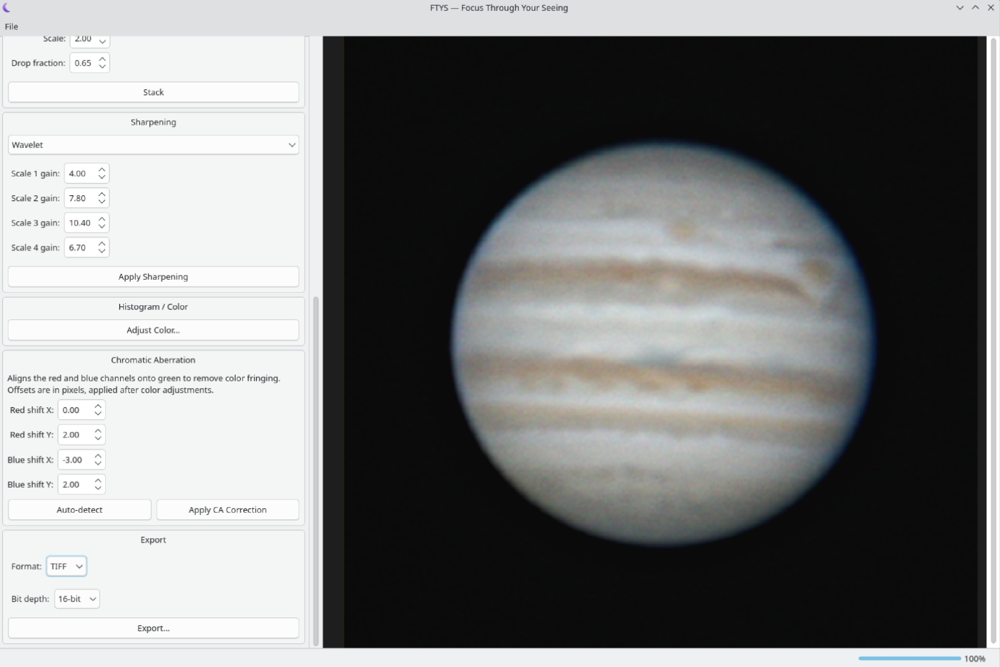

<p align="center"></p>

<h1 align="center">FTYS — Focus Through Your Seeing</h1>

A lucky-imaging stacking app for planets, the Moon, and the Sun. Point it at
a SER/AVI/FITS capture, and it picks the sharpest frames, aligns them,
stacks them, sharpens the result, and lets you fine-tune color and color
fringing before you export it as PNG, TIFF, or FITS (8-bit or 16-bit).

## Screenshots




## Made with Claude

Made with Claude Sonnet 5 High

## Build (Linux)

```
sudo apt-get install qt6-base-dev libopencv-dev libavformat-dev libavcodec-dev \
    libavutil-dev libswscale-dev libcfitsio-dev libfftw3-dev libtiff-dev pkg-config build-essential cmake

mkdir build && cd build
cmake .. -DCMAKE_BUILD_TYPE=Release
make -j$(nproc)
./ftys
```

`ctest --output-on-failure` runs the automated test suite from the same
`build` directory.

## Build (Windows)

**Confirmed working on a real Windows machine** (MSVC + vcpkg), after a
few rounds of real build issues found and fixed along the way — see the
"Windows port" entry in [docs/DEVELOPMENT.md](docs/DEVELOPMENT.md) for
exactly what changed and why. If you hit something that doesn't match
what's written below, that doc's real-user-signal notes are the place to
start.

1. **A C++ compiler and CMake** — install
   [Visual Studio](https://visualstudio.microsoft.com/downloads/) (Community
   edition is fine) with the **"Desktop development with C++"** workload
   checked, which includes both the MSVC compiler and a bundled CMake.
   Then do every step below from the **"Developer Command Prompt for VS"**
   or **"x64 Native Tools Command Prompt for VS"** (Start menu, under the
   Visual Studio folder) rather than a plain `cmd`/PowerShell window — that
   prompt is what puts `cl.exe` and `cmake.exe` on `PATH`; a regular
   terminal has neither, which is why `'cmake' is not recognized...` (or
   the same for `cl`) is the most common first error here. If you'd rather
   install CMake standalone instead of relying on Visual Studio's bundled
   copy, get it from [cmake.org/download](https://cmake.org/download) and
   check **"Add CMake to the system PATH"** during setup.
2. **Qt 6** — install via the [Qt Online Installer](https://www.qt.io/download-qt-installer).
   When you get to the component list, **check the "MSVC 2022 64-bit" box**
   under your Qt version (Widgets/Gui/Core/Concurrent all ship together in
   it) — **not** "MinGW 64-bit", even though that one's often checked by
   default. This project builds everything else (vcpkg's OpenCV/FFmpeg/etc.
   and FTYS itself) with MSVC (`cl.exe`), and a MinGW-built Qt cannot be
   linked into an MSVC-built program — they use different, incompatible
   C++ ABIs (name mangling, exception handling, STL layout), so the link
   step fails (or, confusingly, the *compile* step fails first, with
   errors like `On MSVC you must pass the /permissive- option` — Qt's
   headers detect they're being compiled by `cl.exe` and refuse to
   proceed at all, MinGW kit or not). If you already installed only the
   MinGW component, reopen the Qt Maintenance Tool (or installer) and add
   MSVC 2022 64-bit alongside it — you don't need to remove MinGW, just
   make sure the MSVC one is there too, since that's the one this project
   actually needs. Building Qt itself from source via vcpkg is possible
   but much slower and more fragile — the official installer is the
   easier path.
3. **vcpkg**, for the rest of the dependencies (OpenCV, FFmpeg, CFITSIO,
   FFTW3, libtiff). Clone and bootstrap it anywhere you like — it does
   *not* need to be inside this project, and does not need to be next to
   it either:
   ```
   cd <SOME-FOLDER-OF-YOUR-CHOOSING>
   git clone https://github.com/microsoft/vcpkg
   .\vcpkg\bootstrap-vcpkg.bat
   ```
   Note the full path this creates, e.g. `C:\Users\PC\Documents\GitHub\vcpkg`
   — you'll need it below, and again in step 4.

   This project ships a `vcpkg.json` manifest (in the FTYS repo root)
   listing `opencv4`, `ffmpeg` (with the `avcodec`/`avformat`/`swscale`
   features), `cfitsio`, `fftw3`, and `tiff`. vcpkg only picks a manifest
   up automatically when **the current directory** (not vcpkg's own
   directory) contains a `vcpkg.json` — that's the "requires a list of
   packages... classic mode" error if you run `vcpkg install` from inside
   the vcpkg folder itself. So `cd` into wherever you actually extracted
   the FTYS project (the folder with `vcpkg.json`, `CMakeLists.txt`,
   `README.md`, etc. directly inside it) and invoke vcpkg.exe by its
   **full path** from there — not a relative `..\vcpkg\...`, since vcpkg
   and this project don't have to be, and may well not be, sibling
   folders:
   ```
   cd <PATH-TO-YOUR-FTYS-PROJECT-FOLDER>
   <PATH-TO-VCPKG>\vcpkg install --triplet x64-windows-release
   ```
   If a port name has since changed upstream (`opencv4` has been renamed
   before), `vcpkg search opencv` will show the current name to swap into
   `vcpkg.json`.

   **Expect this step to take a while — FFmpeg alone is commonly
   20–60+ minutes.** It's the one dependency here vcpkg can't fetch as a
   prebuilt binary; it compiles from source through its own Unix-style
   `./configure`-and-`make` build (run under vcpkg's bundled MSYS2/bash,
   not a native MSVC build), and that build includes a large set of
   codecs/formats regardless of which vcpkg *features* are requested — the
   `avcodec`/`avformat`/`swscale` features above only gate optional
   external libraries, not FFmpeg's own already-large default codec list.
   The `-release` triplet above (rather than plain `x64-windows`) is the
   single biggest lever: plain `x64-windows` builds *both* Debug and
   Release configurations back to back, which roughly doubles every
   compile-from-source port's time — since this project only ever builds
   Release, the `-release` triplet skips Debug entirely. It's a normal,
   known-slow vcpkg dependency, not a sign anything is wrong or stuck.
4. Configure and build, pointing CMake at both vcpkg's toolchain file and
   your Qt6 install. **The two `<...>` placeholders below are not real
   paths — replace each with the actual path on your machine** (the vcpkg
   one is wherever you cloned it in step 3 above; the Qt one is the kit
   folder actually installed under `C:\Qt\<version>\`, e.g.
   `C:\Qt\6.7.2\msvc2019_64` on older Qt 6 releases or
   `C:\Qt\6.11.2\msvc2022_64` on Qt 6.8+ — Qt switched its prebuilt Windows
   binaries from an MSVC 2019 build to an MSVC 2022 build starting with Qt
   6.8, which renamed this folder too. Don't guess either the version
   number or the compiler suffix: open `C:\Qt\<version>\` in File Explorer
   and use whichever folder actually starts with `msvc` — **not**
   `mingw_64`, if that's there too (see step 2 above on why): pointing
   this at a MinGW kit fails, since Qt's own headers refuse to compile
   under `cl.exe` at all in that case):
   ```
   mkdir build && cd build
   cmake .. -DCMAKE_BUILD_TYPE=Release ^
       -DCMAKE_TOOLCHAIN_FILE=<PATH-TO-VCPKG>\scripts\buildsystems\vcpkg.cmake ^
       -DVCPKG_TARGET_TRIPLET=x64-windows-release ^
       -DCMAKE_PREFIX_PATH=<PATH-TO-QT-KIT>
   cmake --build . --config Release
   ```
   `-DVCPKG_TARGET_TRIPLET` has to match whatever triplet you actually ran
   `vcpkg install` with above — otherwise CMake looks for the packages
   under `vcpkg_installed\x64-windows\` while they were actually installed
   under `vcpkg_installed\x64-windows-release\`, and every `find_path`/
   `find_library` call in this project's Windows dependency lookup (see
   docs/DEVELOPMENT.md) comes back empty.
5. `ftys.exe` lands in `build\Release\`. It's a shared build against Qt,
   OpenCV, FFmpeg, cfitsio, FFTW3, and libtiff DLLs, so before handing it
   to anyone else run Qt's `windeployqt.exe` against it (bundles the Qt
   DLLs and plugins next to the exe) — it ships inside the Qt kit itself,
   at `<PATH-TO-QT-KIT>\bin\windeployqt.exe` (the same `<PATH-TO-QT-KIT>`
   from step 4 above, e.g. `C:\Qt\6.11.2\msvc2022_64\bin\windeployqt.exe`
   — not on `PATH` by default, so either `cd` there first or give the
   full path), run as `windeployqt.exe path\to\build\Release\ftys.exe` —
   and copy the vcpkg-built DLLs from
   **the FTYS project directory's own `vcpkg_installed\x64-windows-release\bin`**
   (match whichever triplet you actually installed with) alongside it too
   — running `vcpkg install` from the project root in step 3 puts them
   there, in a `vcpkg_installed` folder next to `vcpkg.json`, *not* inside
   vcpkg's own cloned folder. If you're not sure exactly which files that
   folder contains, just copy the whole `bin` folder's `.dll`s alongside
   `ftys.exe` — there's nothing else in there. One more thing
   `windeployqt.exe` *doesn't* cover: on a machine that doesn't already
   have Visual Studio (or the "Build Tools for Visual Studio") installed,
   `ftys.exe` also needs the
   [Microsoft Visual C++ Redistributable](https://learn.microsoft.com/en-us/cpp/windows/latest-supported-vc-redist)
   (provides `vcruntime140.dll`/`msvcp140.dll`/etc.) — this project links
   the MSVC runtime dynamically (CMake+MSVC's default), so without it
   `ftys.exe` fails to even start with a "VCRUNTIME140.dll was not found"
   style error. Passing `--compiler-runtime` to `windeployqt.exe` bundles
   these DLLs alongside the exe too, so anyone you hand it to doesn't
   need to install anything separately. `ctest` and running `ftys.exe`
   from the build directory work without any of this since those DLLs
   (and the Visual Studio-installed runtime) are already on the
   loader's search path there, but a standalone copy of the exe needs them
   next to it.

Not attempted at all yet: macOS. See the [FAQ](#faq) below.

## Using it

Work through the panel top to bottom:

1. **Open Sequence** (File menu) — load a `.ser`, `.avi`, or `.fits`/`.fit` capture.
2. **Assess Quality** — scores every frame for sharpness. **View Quality
   Graph...** shows every frame's score sorted sharpest-to-softest, colored
   by whether it's kept at the current "Keep best %" (with a dashed line
   at the cutoff), and lets you scrub through them — via the slider, or by
   clicking/dragging right on the graph — to preview any specific frame
   alongside its score. Tick **Logarithmic scale** if the drop-off from the
   sharpest frames is so steep it flattens the rest of the graph — it
   redraws the same bars on a log10 scale so the "keep best %" cutoff
   region stays readable instead of being squashed near the bottom.
3. **Keep best %** — pick what fraction of frames to keep (the estimated
   memory use updates live, so you can back off before it gets too high;
   the quality graph's cutoff line and coloring move with it too).
4. **Align Selected Frames** — tracks several points across the disk and
   aligns each frame to them. "Box size", "Number of boxes" (up to 50), and
   "Max deviation" tune how that tracking works; the defaults are a good
   starting point. **Inspect Alignment Points...** lets you scrub through
   frames and watch the tracking boxes to sanity-check it — a box drawn in
   red for a given frame means it was sigma-clipped (its own measured shift
   didn't look trustworthy, so it was replaced by the frame's consensus
   instead). The same dialog's **Manual box editing** mode lets you add,
   drag, or right-click-delete boxes by hand and re-track with them,
   instead of relying only on automatic placement.
5. **Stack** — Mean, Sigma-Clip, or Drizzle.
6. **Apply Sharpening** — Wavelet or Richardson-Lucy.
7. **Adjust Color...** opens a full-size histogram/curve editor window —
   add or remove points directly on the curve (double-click empty space to
   add, double-click a point to remove, drag to move), tune black/white
   points and gamma, brightness, color balance (independent red/green/blue
   gain), hue rotation, and saturation, with the preview updating live as
   you change anything. **Reset to Defaults** clears every control back to
   identity.
8. **Chromatic Aberration** — if the limb/belt edges show red/blue fringing,
   hit **Auto-detect** to estimate a correction, then **Apply CA Correction**.
9. **Export...** — pick a **Format** (PNG, TIFF, or FITS) and, for TIFF/FITS,
   a **Bit depth** (8-bit or 16-bit; PNG is always 8-bit, so the bit-depth
   picker is disabled whenever PNG is selected).

Re-running an earlier step (e.g. re-sharpening) automatically re-applies
anything you'd already done downstream of it, so you don't lose a color
stretch or CA correction just by tweaking an earlier stage.

## FAQ

**What formats can it open?** SER, AVI (via FFmpeg), and FITS (via CFITSIO)
— mono or color, 8-bit and 16-bit (AVI capture is always treated as 8-bit,
since that's how planetary capture AVIs are actually produced).

**What can I point it at?** Anything that's a small bright disk on a mostly
dark background — planets, the Moon, the Sun (with proper solar filtering
on your equipment, obviously). It auto-detects the disk and crops to it.

**How do I tell if my capture actually needs a lower "Keep best %"?** Open
**View Quality Graph...** — a steep drop-off from the sharpest frames to
the rest means seeing was inconsistent and a lower percentage will help a
lot; a fairly flat graph means most frames are similar quality and the
percentage matters less. If the sharpest few frames dominate the graph and
squash everything else flat, tick **Logarithmic scale** to see the shape
of the rest of the distribution.

**What are the alignment "boxes"?** Small tracking patches placed
automatically on the sharpest, highest-contrast parts of the disk (belt
edges, craters, limb detail), each tracked frame to frame — the same idea
as AutoStakkert's Multiple Alignment Points, up to 50 of them. **Inspect
Alignment Points...** lets you watch them work; a box that shows up red on
a given frame means that frame's own measurement for it was rejected
("sigma-clipped") and replaced with the consensus from the other boxes.

**Can I place alignment boxes myself instead of only automatically?** Yes
— in **Inspect Alignment Points...**, turn on **Manual box editing**: click
empty space on the disk to add a box (up to 50 total), drag an existing box
to reposition it, right-click one to delete it, then hit **Re-track with
these boxes**. **Reset to automatic placement** discards your edits and
goes back to the automatic layout.

**What's the Chromatic Aberration panel for?** Correcting red/blue color
fringing around the disk's edge caused by the telescope's optics. Auto-detect
gives you a starting point; nudge the sliders further by eye if needed.

**What can I actually do in the color window?** More than levels and a
curve. **Levels** (black point, white point, gamma) and the curve editor
handle the tone stretch; **Brightness & Color Balance** adds a simple
additive brightness offset plus independent red/green/blue gain (push blue
up to cool the image, red up to warm it); **Hue & Saturation** lets you
rotate the whole image's hue around the color wheel in addition to the
existing saturation control. Everything updates the preview live as you
change it, and **Reset to Defaults** puts every control back to identity
in one click.

**The app crashed / ran out of memory.** Lower the "Keep best %" — the
memory estimate shown next to it tells you roughly how much RAM the kept
frames will use before you commit to stacking them.

**Can I export 16-bit?** Yes — pick TIFF or FITS as the export **Format**
and 16-bit as the **Bit depth**. PNG stays 8-bit only (Qt's PNG writer,
which the app uses for that format, doesn't offer full 16-bit output).
FITS output uses the same NAXIS=2 (mono) / NAXIS=3, NAXIS3=3 (planar RGB)
layout the app's own FITS reader expects, so a FITS export round-trips
back into FTYS correctly.

**Does it run on Windows or macOS?** Yes on Windows — a real user built it
end to end with MSVC/vcpkg following the "Build (Windows)" steps above
and confirmed it runs. macOS hasn't been attempted at all yet.

**I want the deeper technical details.** See
[docs/DEVELOPMENT.md](docs/DEVELOPMENT.md) for the full design log,
including the real-capture testing behind every default value in this app.
