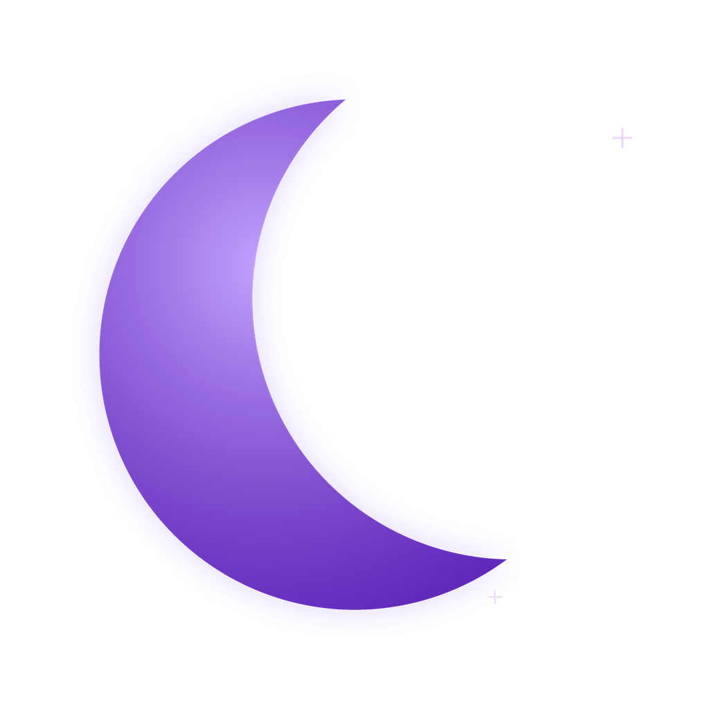
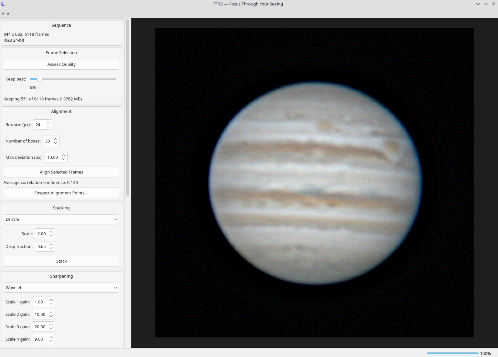

<p align="center"></p>

<h1 align="center">FTYS — Focus Through Your Seeing</h1>

A lucky-imaging stacking app for planets, the Moon, and the Sun. Point it at
a SER/AVI/FITS capture, and it picks the sharpest frames, aligns them,
stacks them, sharpens the result, and lets you fine-tune color and color
fringing before you export a PNG.

## Screenshot



## Made with Claude

Made with Claude Sonnet 5 High

## Build (Linux)

```
sudo apt-get install qt6-base-dev libopencv-dev libavformat-dev libavcodec-dev \
    libavutil-dev libswscale-dev libcfitsio-dev libfftw3-dev pkg-config build-essential cmake

mkdir build && cd build
cmake .. -DCMAKE_BUILD_TYPE=Release
make -j$(nproc)
./ftys
```

`ctest --output-on-failure` runs the automated test suite from the same
`build` directory. Windows and macOS builds haven't been tried yet — see
the [FAQ](#faq) below.

## Using it

Work through the panel top to bottom:

1. **Open Sequence** (File menu) — load a `.ser`, `.avi`, or `.fits`/`.fit` capture.
2. **Assess Quality** — scores every frame for sharpness.
3. **Keep best %** — pick what fraction of frames to keep (the estimated
   memory use updates live, so you can back off before it gets too high).
4. **Align Selected Frames** — tracks several points across the disk and
   aligns each frame to them. "Box size", "Number of boxes" (up to 50), and
   "Max deviation" tune how that tracking works; the defaults are a good
   starting point. **Inspect Alignment Points...** lets you scrub through
   frames and watch the tracking boxes to sanity-check it — a box drawn in
   red for a given frame means it was sigma-clipped (its own measured shift
   didn't look trustworthy, so it was replaced by the frame's consensus
   instead). The same dialog's **Manual box editing** mode lets you add,
   drag, or right-click-delete boxes by hand and re-track with them,
   instead of relying only on automatic placement.
5. **Stack** — Mean, Sigma-Clip, or Drizzle.
6. **Apply Sharpening** — Wavelet or Richardson-Lucy.
7. **Apply Color Adjustments** — levels, curve, saturation.
8. **Chromatic Aberration** — if the limb/belt edges show red/blue fringing,
   hit **Auto-detect** to estimate a correction, then **Apply CA Correction**.
9. **Export PNG...**

Re-running an earlier step (e.g. re-sharpening) automatically re-applies
anything you'd already done downstream of it, so you don't lose a color
stretch or CA correction just by tweaking an earlier stage.

## FAQ

**What formats can it open?** SER, AVI (via FFmpeg), and FITS (via CFITSIO)
— mono or color, 8-bit and 16-bit (AVI capture is always treated as 8-bit,
since that's how planetary capture AVIs are actually produced).

**What can I point it at?** Anything that's a small bright disk on a mostly
dark background — planets, the Moon, the Sun (with proper solar filtering
on your equipment, obviously). It auto-detects the disk and crops to it.

**What are the alignment "boxes"?** Small tracking patches placed
automatically on the sharpest, highest-contrast parts of the disk (belt
edges, craters, limb detail), each tracked frame to frame — the same idea
as AutoStakkert's Multiple Alignment Points, up to 50 of them. **Inspect
Alignment Points...** lets you watch them work; a box that shows up red on
a given frame means that frame's own measurement for it was rejected
("sigma-clipped") and replaced with the consensus from the other boxes.

**Can I place alignment boxes myself instead of only automatically?** Yes
— in **Inspect Alignment Points...**, turn on **Manual box editing**: click
empty space on the disk to add a box (up to 50 total), drag an existing box
to reposition it, right-click one to delete it, then hit **Re-track with
these boxes**. **Reset to automatic placement** discards your edits and
goes back to the automatic layout.

**What's the Chromatic Aberration panel for?** Correcting red/blue color
fringing around the disk's edge caused by the telescope's optics. Auto-detect
gives you a starting point; nudge the sliders further by eye if needed.

**The app crashed / ran out of memory.** Lower the "Keep best %" — the
memory estimate shown next to it tells you roughly how much RAM the kept
frames will use before you commit to stacking them.

**Can I export 16-bit?** Not yet — export is 8-bit PNG only for now.

**Does it run on Windows or macOS?** Not tested yet; the code has nothing
Linux-specific in it, but the packaging/build work for those platforms
hasn't been done.

**I want the deeper technical details.** See
[docs/DEVELOPMENT.md](docs/DEVELOPMENT.md) for the full design log,
including the real-capture testing behind every default value in this app.
